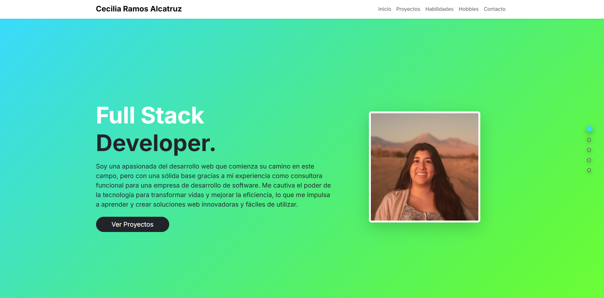
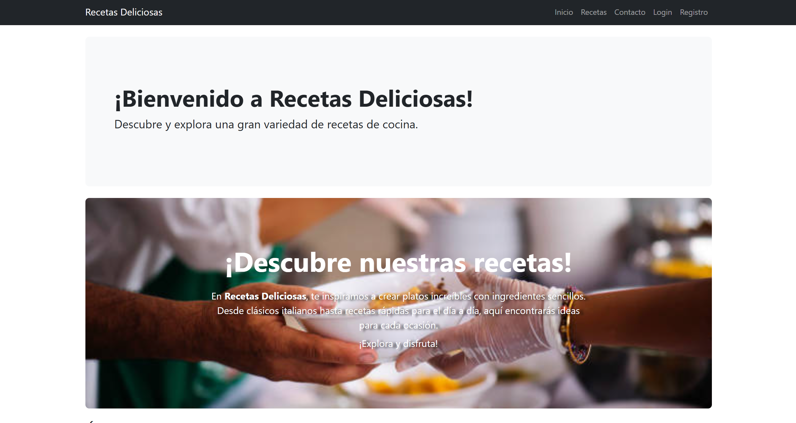

# 👋 ¡Hola! Soy Cecilia Ramos Alcatruz

<div align="center">
  


[](https://github.com/cecyramos)
[](https://www.linkedin.com/in/ceciliaramosalcatruz)
[](https://cecyramos.github.io/Portafolio/)

</div>

## 🚀 Sobre Mí

Soy una **desarrolladora Full Stack** apasionada por crear soluciones web innovadoras y funcionales. Con experiencia como consultora funcional en desarrollo de software, actualmente me especializo en el stack de **Python y Django**, complementado con tecnologías frontend modernas.

Mi enfoque combina pensamiento analítico, atención al detalle y una constante búsqueda de aprendizaje. Me motiva el poder transformador de la tecnología para mejorar la vida de las personas y la eficiencia de los procesos.

### 🎯 Actualmente:
- 🎓 Finalizando el Bootcamp Full Stack Python en **Talento Digital**
- 💻 Desarrollando proyectos personales con Django y JavaScript
- 🌱 Aprendiendo sobre arquitecturas de microservicios y DevOps
- 🔍 Buscando oportunidades para aplicar mis conocimientos en proyectos reales

---

## 💼 Proyectos Destacados

### 🍳 [App de Recetas con Django](https://github.com/cecyramos/evaluacion_portafolio_6.git)

<div align="center">
  
[](https://youtu.be/mKRCTpHwunk)
[](https://www.behance.net/gallery/239580537/App-de-Recetas-con-Django)
[](https://github.com/cecyramos/evaluacion_portafolio_6.git)

</div>

**Aplicación web full stack** desarrollada con Django que permite a los usuarios crear, gestionar y compartir recetas de cocina.

#### ✨ Características Principales:
- 🔐 Sistema de autenticación completo (registro, login, logout)
- 📝 CRUD completo de recetas (Crear, Leer, Actualizar, Eliminar)
- 👤 Perfiles de usuario personalizables
- 🎨 Interfaz intuitiva y responsive con Bootstrap
- 🛡️ Panel de administración personalizado de Django
- 📧 Formulario de contacto funcional
- 🖼️ Carga y gestión de imágenes para recetas

#### 🛠️ Tecnologías Utilizadas:
```
Backend:  Python 3.x | Django 4.x | SQLite
Frontend: HTML5 | CSS3 | Bootstrap 5 | JavaScript
Tools:    Git | GitHub | VS Code
```

#### 📊 Métricas del Proyecto:
- **Líneas de código**: ~2,000+
- **Modelos**: 3 (User, Recipe, Contact)
- **Vistas**: 15+
- **Templates**: 12
- **Tiempo de desarrollo**: 4 semanas

#### 📸 Preview:



> **Nota**: Para ver el proyecto en detalle, consulta el [README del repositorio](https://github.com/cecyramos/evaluacion_portafolio_6.git) con instrucciones completas de instalación y uso.

---

### 🗄️ [Sistema de Gestión de Base de Datos](https://github.com/cecyramos/evaluacion_portafolio_5.git)

Proyecto que demuestra competencias en **modelado relacional y consultas SQL avanzadas**.

**Incluye:**
- Diagrama ER completo
- Scripts DDL (Data Definition Language)
- Scripts DML (Data Manipulation Language)
- Consultas complejas con JOINS, subconsultas y agregaciones
- Procedimientos almacenados (Stored Procedures)
- Triggers y vistas

**Tecnologías**: PostgreSQL, MySQL, DBeaver, Draw.io

[](https://github.com/cecyramos/evaluacion_portafolio_5.git)

---

### 🐍 [Mini Proyectos Python](https://github.com/cecyramos/evaluacion_portafolio_4.git)

Colección de **scripts Python** que demuestran dominio de fundamentos de programación.

**Competencias demostradas:**
- Variables y tipos de datos
- Estructuras de control (if/else, switch)
- Bucles (for, while) e iteración
- Estructuras de datos (listas, tuplas, diccionarios, sets)
- Funciones y modularización
- Manejo de archivos
- Programación orientada a objetos (POO)

**Tecnologías**: Python 3.x, Git, GitHub

[](https://github.com/cecyramos/evaluacion_portafolio_4.git)

---

### 🌐 [Portfolio Personal](https://github.com/cecyramos/Portafolio.git)

**Sitio web profesional** con diseño moderno y responsivo que muestra mis proyectos y habilidades.

**Características:**
- Diseño 100% responsivo
- Navegación dual (navbar + lateral)
- Smooth scroll y animaciones
- Formulario de contacto con validación
- Integración con Font Awesome
- Enlaces directos a proyectos

**Tecnologías**: HTML5, CSS3, JavaScript, jQuery, Bootstrap 5

[](https://cecyramos.github.io/Portafolio/)
[](https://github.com/cecyramos/Portafolio.git)

---

## 🛠️ Stack Tecnológico

### 💻 Lenguajes de Programación


### 🎨 Frontend


### 🔧 Backend & Bases de Datos


### ⚙️ Herramientas & Otros


### 📊 Análisis de Datos


---

## 🌍 Idiomas

| Idioma | Nivel |
|--------|-------|
| 🇪🇸 Español | Nativo |
| 🇬🇧 Inglés | Avanzado (C1) |
| 🇫🇷 Francés | Intermedio (B1) |

---

## 🎓 Educación & Certificaciones

### 🏆 Bootcamp Full Stack Python
**Talento Digital** | 2024-2025
- Desarrollo web con Python y Django
- Frontend con HTML, CSS, JavaScript y Bootstrap
- Bases de datos relacionales (SQL)
- Control de versiones con Git/GitHub
- Metodologías ágiles

### 📜 Certificaciones
- ✅ Fundamentos de Programación Python
- ✅ Bases de Datos Relacionales
- ✅ Desarrollo Web con Django
- ✅ Frontend Development

---

## 🌐 Hosting del Portfolio

Este portfolio está **publicado en GitHub Pages**, un servicio de hosting estático gratuito proporcionado por GitHub.

### 📌 ¿Qué es GitHub Pages?

GitHub Pages es una plataforma de hosting que permite publicar sitios web estáticos directamente desde un repositorio de GitHub. Es ideal para portfolios, documentación de proyectos y páginas personales.

### ✨ Ventajas de GitHub Pages:

- ✅ **Gratuito**: Sin costo alguno
- ✅ **Integrado con Git**: Deployments automáticos al hacer push
- ✅ **HTTPS incluido**: Certificado SSL gratuito
- ✅ **Rápido**: CDN global de GitHub
- ✅ **Fácil de configurar**: Solo requiere un repositorio público
- ✅ **Dominio personalizado**: Opción de usar tu propio dominio

### 🚀 Cómo está desplegado este portfolio:

1. **Repositorio público**: El código está en [`github.com/cecyramos/Portafolio`](https://github.com/cecyramos/Portafolio)
2. **Branch principal**: Se usa la rama `main` para el deployment
3. **Archivo base**: GitHub Pages detecta automáticamente el `index.html` en la raíz
4. **URL del sitio**: [`cecyramos.github.io/Portafolio`](https://cecyramos.github.io/Portafolio/)

### ⚙️ Configuración utilizada:

```
Settings → Pages:
  Source: Deploy from a branch
  Branch: main
  Folder: / (root)
```

### 🔄 Proceso de actualización:

Cada vez que hago cambios y ejecuto:
```bash
git add .
git commit -m "Actualización del portfolio"
git push origin main
```

GitHub Pages automáticamente detecta los cambios y **re-publica el sitio en ~1 minuto**.

### 📊 Estadísticas:

- **Tiempo de deployment inicial**: ~2 minutos
- **Tiempo de actualización**: ~30-60 segundos
- **Uptime**: 99.9% (garantizado por GitHub)
- **Tráfico mensual**: Ilimitado

---

## 🎯 Habilidades Blandas

- 🧩 **Resolución de Problemas**: Capacidad analítica para identificar y solucionar desafíos técnicos
- 💬 **Comunicación Efectiva**: Experiencia como consultora funcional facilitando la comunicación entre equipos técnicos y clientes
- 🤝 **Trabajo en Equipo**: Colaboración en proyectos grupales del bootcamp
- 🔄 **Adaptabilidad**: Transición exitosa de consultora a desarrolladora
- ⏰ **Gestión del Tiempo**: Manejo de múltiples proyectos simultáneamente
- 🎯 **Atención al Detalle**: Código limpio, documentado y bien estructurado
- 📚 **Aprendizaje Continuo**: Siempre buscando mejorar y aprender nuevas tecnologías

---

## 🎨 Intereses y Hobbies

- 🧩 **Juegos de Lógica**: Sudokus, puzzles y desafíos que entrenan el pensamiento analítico
- 🌎 **Viajar**: Explorar nuevas culturas y perspectivas
- 🎵 **Música**: Piano, violín, guitarra y flauta - disciplina y creatividad
- 📖 **Aprendizaje Continuo**: Cursos online, tutoriales y documentación técnica

---

## 📫 Contacto

<div align="center">

¿Tienes un proyecto en mente? ¿Quieres colaborar? **¡Hablemos!**

[](mailto:c.e.c.y_92_@hotmail.com)
[](https://www.linkedin.com/in/ceciliaramosalcatruz)
[](https://wa.me/+56945160340)
[](https://cecyramos.github.io/Portafolio/)

</div>

---

## 📂 Estructura del Portafolio

```
Portafolio/
│
├── index.html                    # Página principal
├── README.md                     # Este archivo
├── LICENSE                       # Licencia MIT
│
├── assets/
│   ├── styles.css               # Estilos personalizados
│   ├── script.js                # JavaScript con jQuery
│   ├── photo.jpg                # Foto de perfil
│   ├── mini_proyectos_python.png           # Preview proyecto 1
│   ├── bases_de_datos_relacionales.png     # Preview proyecto 2
│   └── app_de_recetas_django.png           # Preview proyecto 3
│
└── docs/
    └── index.html               # Documentación adicional (opcional)
```

---

## 📜 Licencia

Este proyecto está bajo la **Licencia MIT** - ver el archivo [LICENSE](LICENSE) para más detalles.

### ¿Qué significa esto?

✅ **Puedes**:
- Usar el código para proyectos personales o comerciales
- Modificar y adaptar el código a tus necesidades
- Distribuir copias del código
- Usar el código en proyectos privados

❌ **Con la condición de**:
- Incluir el aviso de copyright original
- Incluir una copia de la licencia MIT

**Resumen**: Eres libre de usar este código como base para tu propio portfolio. Si lo haces, ¡me encantaría saberlo! 😊

---

## 🙏 Agradecimientos

- **Talento Digital** - Por la oportunidad del bootcamp y el apoyo en mi formación
- **Mis instructores** - Por compartir su conocimiento y experiencia
- **Mis compañeros de bootcamp** - Por el feedback y la colaboración
- **La comunidad open source** - Por las herramientas y recursos gratuitos
- **Bootstrap, Django, jQuery** - Por facilitar el desarrollo web

---

## 🚀 ¿Por qué contratarme?

### 💡 Experiencia única:
Combino **experiencia como consultora funcional** con sólidas habilidades técnicas en desarrollo Full Stack. Entiendo tanto la perspectiva del cliente como la implementación técnica.

### 📚 Aprendizaje continuo:
No solo sé programar, sino que **sé aprender**. Cada proyecto es una oportunidad para mejorar y dominar nuevas tecnologías.

### 🎯 Orientada a resultados:
Todos mis proyectos están **completamente funcionales, documentados y listos para producción**. No son solo demostraciones, son aplicaciones reales.

### 🤝 Trabajo en equipo:
Mi experiencia como consultora me ha enseñado a **comunicarme efectivamente**, entender requerimientos y colaborar con equipos diversos.

### 🌍 Visión global:
Hablo **tres idiomas** (español, inglés, francés) y tengo experiencia intercultural, lo que me permite trabajar en entornos internacionales.

---

## 🎯 Objetivos 2025

- [ ] Contribuir a proyectos open source
- [ ] Obtener certificación en Django avanzado
- [ ] Aprender React o Vue.js
- [ ] Desarrollar una aplicación SaaS completa
- [ ] Participar en hackathons
- [ ] Conseguir mi primer rol como Full Stack Developer

---

### ⭐ Si te gustó mi portfolio, no olvides darle una estrella en GitHub!


---

**Hecho con ❤️ por Cecilia Ramos Alcatruz**

*Última actualización: Noviembre 2025*

</div>
